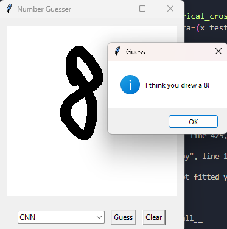

# Digit Guesser
<p align="center">
  
</p>
Digit Guesser is a Python application that allows users to draw a number on a canvas and uses machine learning models to predict the drawn number. The application provides a graphical user interface (GUI) built with Tkinter, where users can select from different machine learning models and see the predicted number.

## Features

- Draw numbers on a canvas using the mouse
- Select from different machine learning models:
  - Logistic Regression
  - Decision Tree
  - Artificial Neural Network (ANN)
  - Convolutional Neural Network (CNN)
- Get real-time predictions of the drawn number
- Clear the canvas and start drawing again

## Requirements

- Python 3.x
- NumPy
- Scikit-learn
- TensorFlow
- Keras
- Pillow
- Tkinter

## Installation

Clone the repository:

```bash
git clone https://github.com/your-username/number-guesser.git
```
Install the required dependencies:

```bash
pip install numpy scikit-learn tensorflow keras pillow
```
Note: Tkinter is usually included with Python installations by default.

Run the application:

```bash
python app.py
```
## Usage
- Launch the application by running python app.py.
- The application window will open, displaying a blank canvas.
- Use your mouse to draw a number on the canvas. The application will recognize the number as you draw.
- Select the desired machine learning model from the dropdown menu.
- Click the "Guess" button to get the predicted number based on the selected model.
- The predicted number will be displayed in a message box.
- To clear the canvas and start drawing again, click the "Clear" button.
- Resize the application window to adjust the canvas size according to your preference.
## Model Training
The machine learning models are trained on the MNIST dataset, which consists of handwritten digit images. The training process is performed when the application starts and may take some time depending on your system's performance.

The following models are available:

- Logistic Regression
- Decision Tree
- Artificial Neural Network (ANN)
- Convolutional Neural Network (CNN)
The accuracy of each model is logged during the training process.

## Customization
You can customize the application by modifying the code in app.py. Some possible customizations include:

- Adding new machine learning models
- Adjusting the hyperparameters of the existing models
- Modifying the GUI layout and styling
- Implementing additional features or functionality
